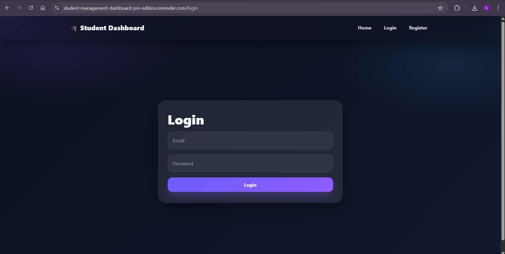
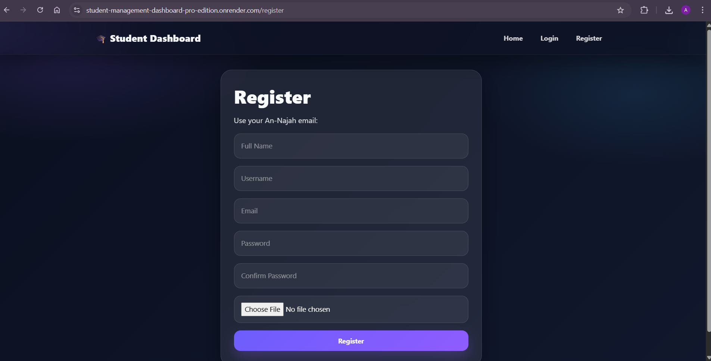
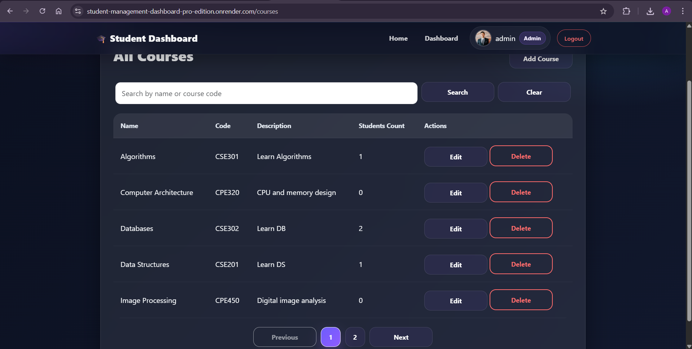
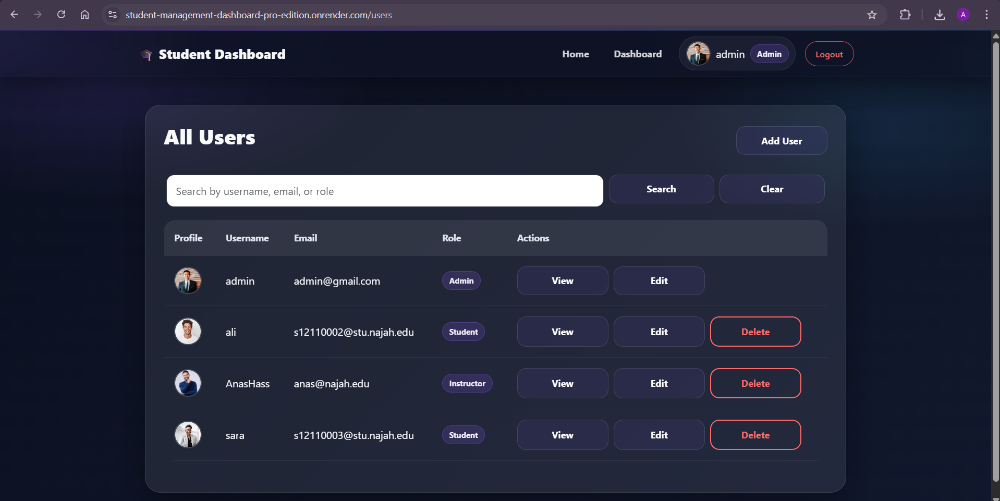

# 🎓 Student Management Dashboard – Pro Edition

A **production-ready Flask web application** for managing students, courses, and users with authentication, role-based access control, profile picture uploads, and REST APIs.

---

## 🌐 Live Demo

👉 **https://student-management-dashboard-pro-edition.onrender.com**


---

## 📌 Project Overview

This project is a full-stack web application built using **Flask** that allows managing:

* 👤 Users (Admin, Instructor, Student)
* 🎓 Students
* 📘 Courses
* 🔗 Student–Course enrollments

It follows a **clean architecture (Routes → Services → Models)** and includes:

* Authentication system (Login / Register)
* Role-based access control
* REST APIs + HTML pages
* Search & pagination
* Profile picture upload
* Error handling (HTML + JSON)
* Automated testing with pytest

---

## 🚀 Features

* 🔐 Authentication (Flask-Login)
* 🧑‍💼 Role-based system:

  * Admin
  * Instructor
  * Student
* 🎓 Many-to-many relationship (Students ↔ Courses)
* 📸 Profile picture upload
* 🔍 Dynamic search (Fetch API)
* 📄 Pagination (UI + API)
* 🔗 Enrollment & unenrollment APIs
* ⚙️ Clean architecture (services layer)
* 🧪 Tested with pytest
* 🌱 Database seeding
* 🎨 Modern UI (Bootstrap + custom styles)

---
## 🔑 Demo Accounts

You can use the following accounts to test the application:

### 👨‍💼 Admin

* **Email:** `admin@gmail.com`
* **Password:** `Admin1234`

---

### 👨‍🏫 Instructor

You can register/login using an email ending with:

```text
@najah.edu
```

Example:

* `instructor1@najah.edu`

---

### 🎓 Student

You can register/login using an email ending with:

```text
@stu.najah.edu
```

Example:

* `s12110002@stu.najah.edu`

> ⚠️ The system automatically detects the role based on the email format.

---

## 🧠 Notes

* Roles are assigned automatically:

  * `@stu.najah.edu` → Student
  * `@najah.edu` → Instructor
* Admin is pre-seeded in the database during setup.
* If `SEED_DB=true`, demo users and data will be created automatically.

---

## ⚙️ Setup Instructions

### 1. Clone the repository

```bash
git clone https://github.com/asmaahassoneh/Student-Management-Dashboard-Pro-Edition.git 
cd Student-Management-Dashboard-Pro-Edition
```

---

### 2. Create virtual environment

```bash
python -m venv venv
venv\Scripts\activate   
```

---

### 3. Install dependencies

```bash
pip install -r requirements.txt
```

---

### 4. Create `.env` file

```env
SECRET_KEY=your_secret_key
DATABASE_URL=sqlite:///students.db
FLASK_ENV=development
SEED_DB=true
```

> The app loads environment variables using `python-dotenv` 

---

### 5. Run the application

```bash
python run.py
```

---

### 6. Run tests

```bash
python -m pytest
```

---

## 📁 Folder Structure

```
Student Management Dashboard - Pro Edition/
│
├── app/
│   ├── models/        # Database models
│   ├── routes/        # API + HTML routes
│   ├── services/      # Business logic layer
│   ├── templates/     # Jinja templates
│   ├── static/        # CSS, JS, uploads
│   ├── config.py      # App configuration
│   ├── extensions.py  # Flask extensions
│   └── __init__.py    # App factory
│
├── tests/             # Pytest tests
├── seed.py            # Seed database script
├── run.py             # App entry point
├── requirements.txt
└── README.md
```

---

## 🖼️ Screenshots

### 🔐 Authentication

#### Login



#### Register



#### After Logout


---

### 🏠 Home

#### Home Page (Before Login)


---

### 📊 Dashboard

#### Admin Dashboard


#### Non-Admin Dashboard


---

### 🎓 Students Management

#### Students List


#### View Student Details


#### Edit Student Courses


#### Student View (Own Courses)


#### Access Restriction (Student Cannot Access Dashboard)


---

### 📘 Courses Management

#### Courses List



#### Add Course


#### Edit Course


#### Search Courses


---

### 👤 Users Management (Admin)

#### Users List



#### View User


#### Edit User


#### Search Users by Role


#### Access Restriction (Non-Admin)


---

### ⚠️ Error Pages

#### Not Found (404)


---


## 🌐 API Reference

### 🎓 Students

| Method | Endpoint                      | Description      |
| ------ | ----------------------------- | ---------------- |
| GET    | `/api/students`               | List students    |
| POST   | `/api/students`               | Create student   |
| GET    | `/api/students/<id>`          | Get student      |
| PUT    | `/api/students/<id>`          | Update student   |
| DELETE | `/api/students/<id>`          | Delete student   |
| POST   | `/api/students/<id>/enroll`   | Enroll in course |
| POST   | `/api/students/<id>/unenroll` | Unenroll         |

---

### 📘 Courses

| Method | Endpoint                     |
| ------ | ---------------------------- |
| GET    | `/api/courses`               |
| POST   | `/api/courses`               |
| GET    | `/api/courses/<id>`          |
| PUT    | `/api/courses/<id>`          |
| DELETE | `/api/courses/<id>`          |
| GET    | `/api/courses/<id>/students` |

---

### 👤 Users (Admin Only)

| Method | Endpoint          |
| ------ | ----------------- |
| GET    | `/api/users`      |
| POST   | `/api/users`      |
| GET    | `/api/users/<id>` |
| PUT    | `/api/users/<id>` |
| DELETE | `/api/users/<id>` |

⚠️ Admin cannot delete their own account.

---

## 🔐 Authentication & Authorization

* Uses **Flask-Login**
* All `/api/*` endpoints require login
* Role-based permissions:

  * Admin → full access
  * Instructor → manage students & courses
  * Student → limited access

---

## 🗃️ Database Design

Entities:

* **User**
* **Student**
* **Course**
* **Enrollment (many-to-many)**

✔ Unique constraint on `(student_id, course_id)`
✔ Cascading deletes supported 

---

## 📦 Response Format

### Success

```json
{
  "success": true,
  "data": {}
}
```

### Error

```json
{
  "success": false,
  "error": "Error message"
}
```

---

## 📸 Profile Upload

* Allowed formats: `png`, `jpg`, `jpeg`, `gif`
* Max size: **2MB**
* Stored in:

```
app/static/uploads
```

---

## 🌿 Git Workflow

| Branch    | Purpose     |
| --------- | ----------- |
| main      | Production  |
| dev       | Development |
| feature/* | Features    |

---

## 🧪 Testing

* Pytest used for:

  * API tests
  * Relationship tests
  * Validation tests

---

## 👩‍💻 Author

**Asmaa Hassoneh**
Computer Engineering Student
Full Stack Developer (Flask + React)

---

## 📄 License

This project is for educational purposes.

---
